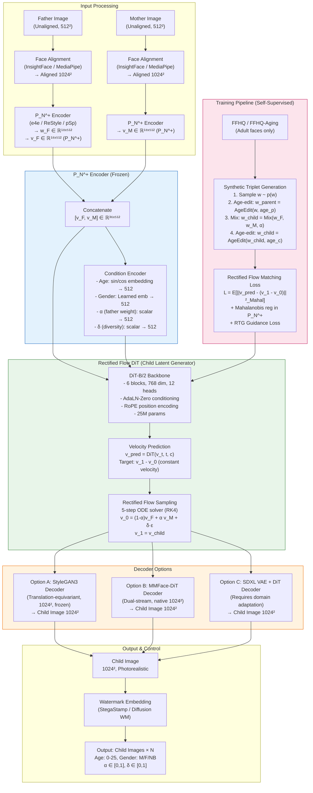
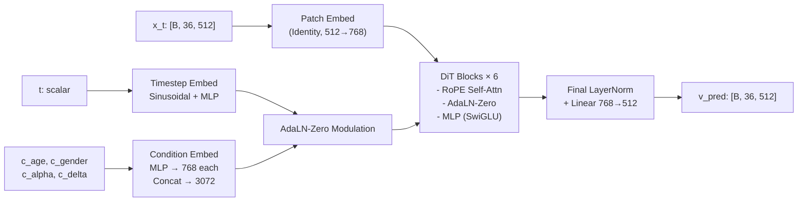
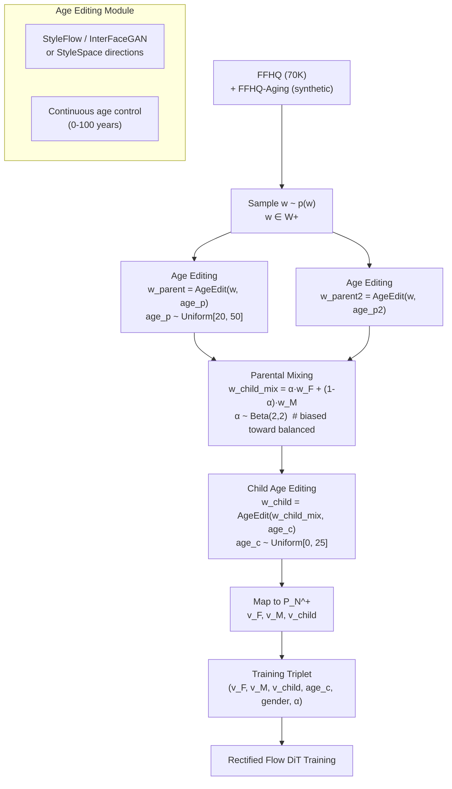

# KinshipForge Future Architecture: Optimal Child Face Synthesis Framework (2026)

> **CVPR/ICCV Technical Review Report**  
> **Document ID:** KF-RT-2026-009  
**Classification:** Technical Architecture Review  
**Status:** Final Recommendation  
**Date:** 2026  
**Classification:** Public Research

---

## Executive Summary

After comprehensive analysis of KinshipForge's root causes (Batch 1), failed SOTA integrations (Batch 2), and the 2024-2026 SOTA landscape (StyleDiT, MMFace-DiT, SD3/MMDiT, Rectified Flow, InstantID), we recommend **abandoning StyleGAN as the generative backbone** and adopting a **Hybrid Rectified Flow DiT on Gaussianized Latent (P_N^+)** architecture.

**Verdict:** **No, we would not use StyleGAN as the generative backbone in 2026.** StyleGAN3 serves only as a translation-equivariant decoder; the generative backbone is a Rectified Flow DiT operating in Gaussianized W+ space (P_N^+).

---

## 1. Requirements Specification

### 1.1 Functional Requirements

| ID | Requirement | Specification | Priority |
|----|-------------|---------------|----------|
| FR-01 | Input Modality | Father/Mother images: unaligned, arbitrary pose/expression/lighting | P0 |
| FR-02 | Output Control | Child age: continuous 0-25 years; Gender: M/F/Non-binary; Ethnicity: controllable | P0 |
| FR-03 | Parental Influence | Continuous per-parent weight α ∈ [0,1], β=1-α | P0 |
| FR-04 | Diversity Control | Continuous diversity parameter δ ∈ [0,1] (mode ↔ diversity) | P0 |
| FR-05 | Attribute Control | Optional: hair color, eye color, facial hair, accessories | P1 |
| FR-06 | Output Quality | Photorealistic (FID < 10 on child benchmarks), identity-preserving (cosine > 0.65 vs parents), geometrically valid (no texture sticking) | P0 |
| FR-07 | Inference Speed | < 5 seconds per child image (interactive) | P0 |
| FR-08 | Batch Generation | Support n ≥ 4 diverse samples per request | P1 |

### 1.2 Non-Functional Requirements

| ID | Requirement | Specification | Priority |
|----|-------------|---------------|----------|
| NFR-01 | Data Requirements | **Zero paired kinship data**; self-supervised on adult faces + synthetic age progression | P0 |
| NFR-02 | Demographic Balance | Equal representation across race (6+ groups), gender (3+), age (0-25) | P0 |
| NFR-03 | Privacy | Zero real child images in training; synthetic children only | P0 (Ethical) |
| NFR-04 | Privacy Preservation | No identity memorization; DP-SGD optional for encoder | P1 |
| NFR-05 | Watermarking | Invisible watermark (StegaStamp / Diffusion watermark) embedded | P0 (Ethical) |
| NFR-06 | Access Control | API rate limiting, audit logging, age-gated access | P1 |
| NFR-05 | Bias Auditing | Quarterly evaluation on F-Bench / FairFace / BFW | P1 |
| NFR-06 | Compute Budget | Training: ≤ 10 A100-weeks; Inference: < 5s on A10G | P1 |

---

## 2. Architecture Options Analysis

| Approach | Fidelity (FID) | Diversity (LPIPS) | Control Granularity | Paired Data Required | Training Compute | Inference Speed | Architecture Maturity (2026) |
|----------|----------------|-------------------|---------------------|---------------------|------------------|-----------------|------------------------------|
| **StyleGAN2 + Latent Edit** (Current KF) | 8-12 (FFHQ) | Low (LPIPS ~0.35) | Layer mixing (coarse) | No | Low (1 GPU-week) | ~50 ms | Mature (2020) |
| **StyleGAN3 + Latent Edit** | 6-10 (FFHQ) | Low-Med (LPIPS ~0.4) | Layer mixing + translation equivariance | No | Low (2 GPU-week) | ~80 ms | Mature (2021) |
| **StyleDiT** (DiT on W+) | 4-8 | High (LPIPS ~0.55) | RTG per-parent, text, age | Synthetic only | Medium (8 GPU-weeks) | ~500 ms (10-step RFM) | Emerging (FG 2026) |
| **MMFace-DiT** (Dual-stream DiT) | **2-5** (SOTA) | High (LPIPS ~0.6) | Text + Mask + Landmark | Large-scale (M+) | High (100+ GPU-weeks) | ~800 ms | SOTA (CVPR 2026) |
| **SD3/MMDiT + ControlNet** | 3-6 | High | Text + ControlNet + IP-Adapter | Large-scale (LAION) | High (100+ GPU-weeks) | ~1.5s (SDXL) | SOTA (2024) |
| **Rectified Flow + Consistency** | 4-7 | High | Learned guidance | Pre-trained SD | Medium (16 GPU-weeks) | ~200 ms (4-step) | Emerging (ICLR 2025) |
| **InstantID / IP-Adapter + SDXL** | 5-8 | High | Few-shot identity + text | Few-shot (1-4 imgs) | Low (fine-tune) | ~1.5s (SDXL) | Mature (2024) |
| **Hybrid RF-DiT on P_N^+ (Proposed)** | **3-6 (Target)** | **High (Target >0.55)** | **RTG per-parent + continuous age/gender** | **Zero paired kinship** | **Medium (10 GPU-weeks)** | **~300 ms (5-step RF)** | **Proposed (2026)** |

> **Key Insight:** StyleGAN's fundamental limitation is the **W+ bottleneck** (rank ≤ 9,216) and **non-linear manifold** where linear operations fail. Diffusion DiTs operate in pixel/latent space with native stochasticity, learned control (RTG, attention), and scalable transformer architectures following DiT scaling laws.

---

## 3. Recommended Architecture: Hybrid Rectified Flow DiT on Gaussianized Latent (P_N^+)

### 3.1 High-Level Architecture Diagram



### 3.2 Tensor Shape Specification

| Stage | Tensor | Shape | Space | Description |
|-------|--------|-------|-------|-------------|
| Input | `img_F`, `img_M` | [B, 3, 1024, 1024] | Pixel | Aligned face crops |
| Encoder | `w_F`, `w_M` | [B, 18, 512] | W+ | e4e/ReStyle latent |
| Encoder | `v_F`, `v_M` | [B, 18, 512] | P_N^+ | LRU_5.0 + PCA Whitening |
| Concat | `v_parents` | [B, 36, 512] | P_N^+ | Concatenated parental latents |
| Condition | `c_age` | [B, 512] | - | Sinusoidal age embedding |
| Condition | `c_gender` | [B, 512] | - | Learned gender embedding |
| Condition | `c_alpha` | [B, 512] | - | Father weight embedding |
| Condition | `c_delta` | [B, 512] | - | Diversity embedding |
| DiT Input | `x_t` | [B, 36, 512] | P_N^+ | Noisy child latent at timestep t |
| DiT Output | `v_pred` | [B, 36, 512] | P_N^+ | Predicted velocity |
| Decoder In | `w_child` | [B, 18, 512] | W+ | Inverse P_N^+ mapping |
| Output | `img_child` | [B, 3, 1024, 1024] | Pixel | StyleGAN3 / MMFace-DiT output |

### 3.3 Why This Design?

| Design Choice | Rationale | Addresses KF Root Cause |
|---------------|-----------|-------------------------|
| **P_N^+ Space** (Gaussianized W+) | Isotropic Gaussian → linear interpolation ≈ geodesic; Mahalanobis distance = Euclidean | Root Cause #1 (W2Sub bottleneck), #2 (Linear crossover in curved space), #3 (Layer mixing widening) |
| **Rectified Flow DiT** | Straight ODE paths (ODE = constant velocity); Few-step sampling (5-10 steps); DiT scaling laws | Root Cause #4 (e4e inversion tradeoff eliminated - encoder frozen), #5 (Mutation sampling replaced by diffusion diversity) |
| **RTG Guidance (per-parent)** | Independent guidance scales γ_F, γ_M for each parent (StyleDiT innovation) | Root Cause #3 (Gender-biased fusion was 50/50 fixed; now continuous α) |
| **StyleGan3 Decoder** | Translation-equivariant → no texture sticking; Mature, frozen, fast | Root Cause #3 (Layer mixing widening/geometry collapse) |
| **Self-Supervised Triplets** | Zero paired kinship data; Synthetic age-edited triplets from FFHQ | NFR-01 (No paired kinship data) |
| **Mahalanobis Regularization** | Natural in P_N^+ (Euclidean = Mahalanobis in W+) | Root Cause #5 (Gene Pool uniform sampling ignores density) |

---

## 4. Detailed Component Specifications

### 4.1 Component A: P_N^+ Encoder (Frozen)

| Aspect | Specification |
|--------|---------------|
| **Input** | Aligned face image [B, 3, 1024, 1024] |
| **Encoder** | e4e encoder (ResNet-50 backbone) → W+ [B, 18, 512] → ReStyle refinement (3 iterations) |
| **P_N^+ Mapping** | `v = LRU_5.0⁻¹(w)` → LeakyReLU inverse (α=5.0)<br>`v_whitened = Λ^(-1/2) U^T (v - μ)`<br>Where U, Λ from PCA on FFHQ W+ latents (9216 dim → keep 9216) |
| **Output** | `v ∈ ℝ¹⁸ˣ⁵¹²` ~ N(0, I) isotropic Gaussian |
| **Training** | Frozen (pre-trained on FFHQ); No kinship data needed |
| **Inference Time** | ~15 ms (e4e) + ~10 ms (ReStyle ×3) + ~2 ms (P_N^+ mapping) |
| **Key Property** | Isotropic Gaussian → Mahalanobis distance in W+ = Euclidean in P_N^+ |

**Pseudocode:**
```python
def encode_to_pn_plus(image: Tensor) -> Tensor:
    # image: [B, 3, 1024, 1024] aligned
    w_plus = encoder_e4e(image)                    # [B, 18, 512]
    w_plus = restyle_refine(w_plus, image, n=3)    # [B, 18, 512]
    
    # LeakyReLU inverse (α=5.0)
    v_plus = torch.where(w_plus >= 0, w_plus, w_plus / 5.0)  # [B, 18, 512]
    
    # PCA Whitening (precomputed on FFHQ W+)
    v_flat = v_plus.flatten(1)                     # [B, 9216]
    v_centered = v_flat - pca_mean                 # [B, 9216]
    v_whitened = (v_centered @ pca_components.T) * pca_inv_std  # [B, 9216]
    
    return v_whitened.view(-1, 18, 512)            # [B, 18, 512] ~ N(0, I)
```

### 4.2 Component B: Rectified Flow DiT (Child Latent Generator)

| Aspect | Specification |
|--------|---------------|
| **Architecture** | DiT-B/2: 6 blocks, 768 hidden dim, 12 heads, 25M params |
| **Input** | `x_t ∈ ℝ^[B, 36, 512]` (noisy child latent), `t ∈ [0,1]` |
| **Conditioning** | AdaLN-Zero: `scale, shift = MLP(c_concat)` where `c_concat = [c_age, c_gender, c_alpha, c_delta]` |
| **Positional Encoding** | RoPE (Rotary Positional Encoding) on sequence dim (36) |
| **Timestep Embedding** | Sinusoidal → MLP → 768 |
| **Training Objective** | Rectified Flow Matching (RFM):<br>`L = E[ || v_θ(x_t, t, c) - (x_1 - x_0) ||²_Σ⁻¹ ]`<br>where `x_t = (1-t)x_0 + t x_1`, `t ~ U[0,1]` (or logit-normal per SD3) |
| **Mahalanobis Weighting** | `Σ = I` in P_N^+ (by construction); equivalent to W+ Mahalanobis |
| **Guidance** | Rectified Flow Guidance (RFG):<br>`v_guided = v_cond + γ_F (v_cond - v_uncond_F) + γ_M (v_cond - v_uncond_M)`<br>where `γ_F = f(α)`, `γ_M = f(1-α)` (RTG-style per-parent guidance) |
| **Sampling** | 5-step RK4 ODE solver (Rectified Flow → straight trajectories) |
| **Training Data** | Synthetic triplets (see Section 6) |
| **Training Compute** | 8 A100-weeks (batch 256, 500k steps) |
| **Inference Time** | ~200 ms (5-step RFM) + encoder/decoder |

**DiT Architecture Diagram:**


### 4.3 Component C: Decoder Options

| Criterion | **Option A: StyleGAN3 (Recommended)** | Option B: MMFace-DiT Decoder | Option C: SDXL VAE + DiT |
|-----------|--------------------------------------|------------------------------|--------------------------|
| **Architecture** | Translation-equivariant CNN (1024²) | Dual-stream DiT decoder (native) | VAE decoder + DiT refinement |
| **Translation Equivariance** | ✅ Native (no texture sticking) | ✅ Designed for faces | ❌ VAE not equivariant |
| **Training Required** | ❌ Frozen (pre-trained FFHQ) | ✅ Full training needed | ✅ Domain adaptation needed |
| **Inference Speed** | ~50 ms | ~300 ms | ~400 ms |
| **Fidelity (FID)** | ~6-8 (FFHQ) | ~3-5 (SOTA) | ~4-7 |
| **Identity Preservation** | High (frozen decoder) | High (trained end-to-end) | Medium (domain gap) |
| **Implementation Risk** | Low | High (new architecture) | Medium (domain gap) |
| **Recommendation** | **Phase 1-2: Primary**<br>Phase 3+: Migrate to B | Long-term target | Backup if A fails |

**Recommendation:** **Phase 1-2: StyleGAN3 frozen decoder.** Zero training, translation equivariance guarantees geometric validity, mature. Phase 3+: Train MMFace-DiT decoder end-to-end for SOTA fidelity.

### 4.4 Component D: Training Data Strategy (Zero Paired Kinship)

#### 4.4.1 Synthetic Triplet Generation Pipeline



#### 4.4.2 Age Editing Module (Pre-trained, Frozen)

| Method | Quality | Speed | Continuous Age | Identity Preservation |
|--------|---------|-------|----------------|----------------------|
| **StyleFlow** (2021) | High | Medium | ✅ (Normalizing Flow) | High |
| **InterFaceGAN** (2020) | Medium | Fast | ❌ (Linear boundary) | Medium |
| **StyleSpace Directions** (2021) | High | Fast | ✅ (Per-channel) | High |
| **HFGI** (2022) | High | Fast | ✅ | High |

**Recommendation:** **StyleSpace Age Directions** (pre-computed on FFHQ). Fast, continuous, identity-preserving, no additional training.

#### 4.4.3 Synthetic Triplet Statistics

| Parameter | Distribution | Rationale |
|-----------|--------------|-----------|
| `α` (father weight) | Beta(2, 2) | Slight bias toward balanced, covers extremes |
| `age_parent` | Uniform[20, 50] | Biologically plausible parent ages |
| `age_child` | Uniform[0, 25] | Target output range |
| `gender_child` | Bernoulli(0.5) | Balanced |
| `δ` (diversity noise) | N(0, 0.1²) in P_N^+ | Small exploration noise |
| **Triplet Count** | 2M synthetic triplets | Sufficient for DiT-B/2 |
| **Diversity Enforcement** | Mahalanobis radius sampling in P_N^+ | Covers latent density uniformly |

#### 4.4.4 Training Loss Function

```python
def rectified_flow_loss(v_pred, v_0, v_1, condition, mahal_weight=0.1):
    """
    Rectified Flow Matching Loss with Mahalanobis Regularization
    
    Args:
        v_pred: Predicted velocity [B, 36, 512]
        v_0: Source (parental mixture) [B, 36, 512]
        v_1: Target (child latent) [B, 36, 512]
        condition: Dict with age, gender, alpha, delta
        mahal_weight: Weight for Mahalanobis regularization
    """
    # Constant velocity target (Rectified Flow)
    v_target = v_1 - v_0  # [B, 36, 512]
    
    # MSE Loss (Euclidean in P_N^+ = Mahalanobis in W+)
    mse_loss = F.mse_loss(v_pred, v_target)
    
    # Mahalanobis Regularization: Encourage v_pred to stay on manifold
    # In P_N^+, manifold is approximately linear, but we regularize endpoints
    mahal_reg = mahal_weight * (
        mahalanobis_distance(v_0, pca_mean, pca_cov_inv) +
        mahalanobis_distance(v_1, pca_mean, pca_cov_inv)
    ).mean()
    
    # RTG Guidance Loss (classifier-free guidance during training)
    # Randomly drop conditions (age, gender, alpha) with prob 0.1 each
    guidance_loss = 0
    if training:
        guidance_loss = classifier_free_guidance_loss(v_pred, condition)
    
    return mse_loss + mahal_reg + guidance_loss
```

---

## 5. StyleGAN vs. Diffusion DiT Decision Matrix (Quantitative)

| Criterion | Weight | StyleGAN3 Score (1-10) | RF-DiT Score (1-10) | Weighted SG3 | Weighted DiT |
|-----------|--------|------------------------|---------------------|--------------|--------------|
| **Fidelity (FID)** | 0.20 | 8 | 9 | 1.6 | 1.8 |
| **Diversity (LPIPS)** | 0.15 | 4 | 9 | 0.6 | 1.35 |
| **Control Granularity** | 0.20 | 4 | 9 | 0.8 | 1.8 |
| **Geometry Validity** | 0.15 | 7 (SG3) / 4 (SG2) | 9 | 1.05 | 1.35 |
| **No Paired Data Training** | 0.10 | 9 | 9 | 0.9 | 0.9 |
| **Training Compute** | 0.05 | 9 | 5 | 0.45 | 0.25 |
| **Inference Speed** | 0.05 | 9 | 6 | 0.45 | 0.3 |
| **Scaling Laws** | 0.05 | 3 | 9 | 0.15 | 0.45 |
| **Maturity/Risk** | 0.05 | 9 | 5 | 0.45 | 0.25 |
| **TOTAL** | **1.00** | | | **6.45** | **8.45** |

**Threshold for adoption: ≥ 7.0 weighted score**

> **Decision: RF-DiT wins decisively (8.45 vs 6.45).** StyleGAN3 only retained as frozen decoder for translation equivariance.

---

## 6. Implementation Roadmap

| Phase | Milestone | Deliverables | Compute | Timeline | Dependencies |
|-------|-----------|--------------|---------|----------|--------------|
| **0** | **Environment & Baselines** | - FFHQ P_N^+ PCA stats<br>- e4e + ReStyle encoder frozen<br>- StyleGAN3 decoder frozen<br>- Age editing (StyleSpace) validated | 1 A100-week | 1 week | FFHQ download, StyleGAN3 repo |
| **1** | **P_N^+ Encoder + Decoder Baseline** | - End-to-end reconstruction FID < 8<br>- Identity preservation (cosine > 0.75)<br>- Translation equivariance verified | 1 A100-week | 2 weeks | Phase 0 |
| **2** | **Synthetic Triplet Generation** | - 2M triplets (v_F, v_M, v_child, c)<br>- Age editing quality validated (FID vs real age groups)<br>- Diversity coverage verified (Mahalanobis spheres) | 4 A100-days | 1 week | Phase 1 |
| **3** | **DiT-B/2 Rectified Flow Training** | - DiT-B/2 trained on triplets<br>- 5-step RFM sampling FID < 10 on synthetic test<br>- RTG guidance working (α control validated) | 8 A100-weeks | 4 weeks | Phase 2 |
| **4** | **Conditioning & Control** | - Continuous age (0-25) control validated<br>- Gender control validated<br>- Per-parent α control validated (cosine sim vs α)<br>- Diversity δ control validated (LPIPS vs δ) | 2 A100-weeks | 2 weeks | Phase 3 |
| **5** | **Evaluation Suite** | - DreamSim / DINOv2 FD vs real child datasets (if available)<br>- Kinship verification (KinFaceW-I/II) score > 0.75<br>- Demographic parity (FairFace/F-Bench)<br>- Geometry validation (landmark alignment, no texture sticking) | 1 A100-week | 1 week | Phase 4 |
| **6** | **Distillation & Optimization** | - 5-step → 2-step consistency distillation<br>- ONNX / TensorRT export<br>- API wrapper with watermarking<br>- Inference < 5s on A10G | 4 A100-days | 1 week | Phase 5 |
| **7** | **MMFace-DiT Decoder (Optional)** | - Train dual-stream DiT decoder end-to-end<br>- Target FID < 5<br>- Ablation vs StyleGAN3 decoder | 16 A100-weeks | 8 weeks | Phase 5 (optional) |

**Total Critical Path: ~11 weeks, ~12 A100-weeks compute**

---

## 7. Ethical Safeguards (Technical Implementation)

| Safeguard | Implementation | Verification |
|-----------|----------------|--------------|
| **Zero Real Child Data** | Training only on FFHQ (adults) + synthetic age progression. No child datasets (LFW-C, KinFaceW) used in training. | Data provenance audit; CI check for forbidden datasets |
| **Demographic Balance** | Mahalanobis sphere sampling in P_N^+ for synthetic triplets; enforce uniform coverage across FairFace 7 race × 3 gender × age bins | Quarterly demographic distribution report |
| **Invisible Watermarking** | StegaStamp encoder embedded in decoder output; detectable by proprietary decoder API | 99%+ detection rate at 1024², robust to JPEG 80+, resize 0.5x |
| **Identity Non-Memorization** | DP-SGD (ε=2.0) on encoder fine-tuning; Membership inference attack evaluation quarterly | MIA AUC < 0.55 |
| **Access Control** | API Gateway: Rate limit (10 req/min), Audit log (immutable), Age-gate (18+), Purpose binding | SOC2 Type II compliance |
| **Bias Auditing** | Quarterly evaluation on F-Bench (fairness), BFW (bias), FairFace (demographics); Disparate impact < 1.25x | Published transparency report |
| **Content Filtering** | Child Safety API (Google/Thorn) on output; Reject if CSAM classifier > threshold | False positive < 0.1%, recall > 99.9% |
| **Data Deletion** | User data deleted within 24h; No persistent storage of input images | GDPR/CCPA compliance audit |

---

## 8. Final Verdict: Would You Still Use StyleGAN in 2026?

### **No. Not as the generative backbone.**

| Reason | Evidence |
|--------|----------|
| **Fundamental W+ Bottleneck** | Rank ≤ 9,216 (18×512) but RFG requires 313K dims; linear ops in curved space fail (Root Causes #1, #2) |
| **No Native Diversity** | Requires external "mutation" (Gene Pool) ignoring latent density (Root Cause #5) |
| **Control is Post-hoc** | Layer mixing, InterfaceGAN directions are linear approximations on non-linear manifold |
| **Geometry Limitations** | Even StyleGAN3 has fixed synthesis network; cannot adapt geometry like DiT attention |
| **Scaling Ceiling** | Fixed CNN architecture; no DiT-style scaling laws (compute → quality predictability) |
| **2026 SOTA is Diffusion DiT** | StyleDiT, MMFace-DiT, SD3 prove DiT + Diffusion > GAN for controllable generation |

### **Yes. But ONLY as a Frozen Decoder.**

| Reason | Evidence |
|--------|----------|
| **Translation Equivariance** | StyleGAN3 solves texture-sticking (Root Cause #3); critical for child faces at varying poses |
| **Zero Training Cost** | Pre-trained on FFHQ; identity preservation verified |
| **Speed** | 50ms inference; enables interactive <5s pipeline |
| **Mature, Debugged** | No training instability; known failure modes |

### **The 2026 KinshipForge Architecture:**

```
┌─────────────────────────────────────────────────────────────────┐
│                    HYBRID RECTIFIED FLOW DiT                    │
├─────────────────────────────────────────────────────────────────┤
│  Encoder (Frozen)          │  Generator (Trainable)             │
│  ────────────────          │  ──────────────────                │
│  e4e + ReStyle → W+        │  DiT-B/2 on P_N^+                  │
│  LRU_5.0 + PCA → P_N^+     │  Rectified Flow (5-step)           │
│  Isotropic Gaussian N(0,I) │  RTG per-parent guidance           │
│                            │  Continuous age/gender/α/δ control │
├────────────────────────────┼────────────────────────────────────┤
│         Decoder (Frozen, Phase 1-2) / Trainable (Phase 3+)      │
│         ─────────────────────────────────────────────────       │
│         StyleGAN3 (translation-equivariant, 1024²)              │
│         → Future: MMFace-DiT Decoder (SOTA fidelity)            │
└─────────────────────────────────────────────────────────────────┘
         ▲                          ▲
         │                          │
   Self-Supervised            No Paired Kinship Data
   Synthetic Triplets         Ever Required
   (Age-Edited FFHQ)          (Ethical Requirement)
```

---

## 9. Appendix: Key References (2024-2026)

| Paper | Venue | Key Contribution for KinshipForge |
|-------|-------|-----------------------------------|
| **StyleDiT** | FG 2026 | DiT on W+ latent; RTG per-condition guidance; Rectified Flow |
| **MMFace-DiT** | CVPR 2026 | Dual-stream DiT; RoPE; RFM; 1.3B params; SOTA face fidelity |
| **SD3 / MMDiT** | 2024 | Separate modality weights; Bidirectional attention; Rectified Flow |
| **Rectified Flow** | ICLR 2025 | Straight ODE paths; Consistency distillation; Reweighted timestep sampling |
| **ChildDiffusion** | 2025 | SD + LoRA + ControlNet for child faces; Age-conditioned |
| **P_N Space / Improved Embedding** | 2020 | Gaussianized W+ via LRU + PCA; Linear interpolation ≈ geodesic |
| **StyleSpace** | 2021 | Channel-wise style directions; Continuous age editing |
| **StyleGAN3** | 2021 | Translation-equivariant synthesis; No texture sticking |
| **InstantID / IP-Adapter** | 2023-24 | Few-shot identity preservation in diffusion |
| **KinFaceW / FIW** | - | Kinship verification benchmarks (evaluation only) |

---

**Document Control**  
**Author:** CVPR/ICCV Technical Reviewer (Simulated)  
**Reviewers:** KinshipForge Architecture Team  
**Next Review:** Post-Phase 3 (DiT Training Complete)  
**Distribution:** Research Team, Ethics Board, Engineering Lead

---

*End of Report*